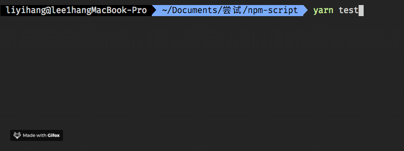

---

title = "npm-script中的&&和&一个问题"
date = 2019-01-20T22:53:31+08:00
tags = ["node","npm"]
draft = false
description = "npm script中命令行&&与&的区别"

---

## 结论先上

在bash命令/npm script中使用`&`来实现`并发`效果时，实际上是把`&`左侧的命令丢入后台运行，右侧剩余命令看做 _**整体**_ 任务在前台运行，以此来实现并发效果。

而`&&`是串行执行两侧命令，先执行完左侧时候再执行右侧。

_**切记！！！**_

``` shell
command1 & command2 && command3
```

并不是并发执行`command1`和`command2`后再执行`command3`

而是并发执行`command1`和`command2 && command3`

___

## 过程

最近，我组在远端构建组内`sdk`时踩了个坑！！！原先我们是`ci`构建好sdk，推送到服务器上，发现经常会出现推过去的`zip`包文件不全，或者文件全了但是文件的内容不全。很是神奇。

排查一番后发现，我们`package.json`中的`scripts`写了个大概如下的命令

``` shell
cross-env npm run build-core & npm run build-ui
```

并把这个命令用 `npm run build` 代替。

嗯~看着没问题，`并行`的构建`sdk-core`以及`sdk-ui`。

构建好后就应该是打包，我们却在`ci`里面写了个“致命”的命令

``` shell
 npm run build && node publish.js
```

`publish.js`就是我们用来发布到的脚本文件。看上去也是没问题。。但是细想一下，整个命令就变成了这样

``` shell
cross-env npm run build-core & npm run build-ui && node publish.js
```

这里就踩到了一个坑！！！！

我们原来是想先并行的构建`ui`与`core`，完成后执行上传脚本。。但是这里却变成了`并行`执行下面两件事

``` shell
1. 构建core
2. 构建ui和发布
```

这里我们可以粗略地理解为`&&`的优先级更高所以导致了这种现象。

但其实是`bash`中`&`命令的特殊性导致的，前面我对“并行”做了特殊高亮，是因为表现上是并行的，但是`&`命令的含义并不是并行的执行任务。

`&`命令的真实含义是把左侧的任务立即进入后台执行，这样就是实现了`&`两侧任务同时并发执行的效果，实际上会导致上面说的不符合期望的原因并不是因为优先级问题，按我们的理解`&`作为运算符的话优先级是高于`&&`的，之所以会造成上面的原因是因为命令按顺序执行的话，`&`使得左侧任务瞬间进入后台执行，右侧剩余命令就看做一个整体任务了。

___

## show demo

[code地址](https://github.com/lee1hang/issue-blog/tree/master/code/npm-script-%26%26-%26)

准备好4个文件`index1.js`,`index2.js`,`index3.js`以及`package.json`。

内容分别如下

index1.js

``` javascript
console.log('start index1');

setTimeout(() => {
  console.log('end index1');
}, 6000);

```

index2.js

``` javascript
console.log('start index2');

setTimeout(() => {
  console.log('end index2');
}, 3000);
```

index3.js

``` javascript
console.log('start index3');

setTimeout(() => {
  console.log('end index3');
}, 500);
```

package.json

``` json
{
  "name": "npm-script",
  "version": "1.0.0",
  "main": "index.js",
  "license": "MIT",
  "scripts": {
    "test":"node index1.js & node index2.js && node index3.js"
  }
}
```

接着我们运行`npm test`。

神奇的事情发生了！！！



``` shell
node index1.js & node index2.js && node index3.js
```

错误的理解上面的执行顺序的话，期望结果应该是在`index1`和`index2`结束后才开始`index3`，实际输出否决了这个想法。

那把`&`当做并行运算符而`&&`的优先级更高的话，结果应该是就是`index3`是在`index2`后开始，而`index1`和`index2`是并行开始，看上面的图确实很像，但有个神奇的地方是，终端已经输出`done`了，退出了，过了一会才再次输出`end index1`！！

确实很神奇，但结合上面说的`&`的原理就能理解。

先把`index1`扔到后台执行，当前终端执行`&`右边的命令，跑完`index2`后跑`index3`，然后结束当前终端，此时在后台的`index1`可能还没执行完。这样就造成了图示现象。

## 参考资料

* [Bash & (ampersand) operator](https://stackoverflow.com/a/9258753)

* [&& vs & with the test command in bash](https://stackoverflow.com/a/26770612)

